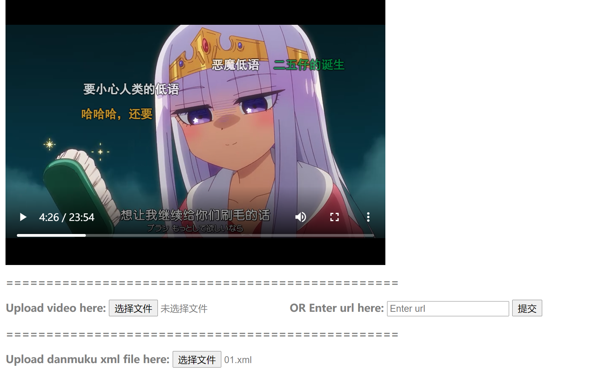

# Danmuku Player
[](https://mit-license.org/)
## About
This is a fun little project that aims to bring you a clear and bilibili-free experience of watching animes with danmuku (弹幕，bullet chat). It's mainly for self-entertainment and for practicing my frontend skills. Since I'm a total beginner to frontend development, there are probably tons of problems in my code, but luckily it works: the performance is acceptable and I don't have to give away my money to 叔叔 anymore!

“番剧不能失去弹幕，就像西方不能失去耶路撒冷”. For me, danmuku is an essential part in my experience of watching animes. However, today, there really aren't many animes to watch on Bilibili if you don't pay for the Bilibili Premium. I don't want to pay for a website where my favourite yuri animes are either taken down (e.g. Sakura Trick, Citrus, Slow Start...) or got the most important love scenes deleted by Bilibili (Bloom into You)! Luckily, some of the Bilibili api are stil usable. That's the motivation for this project. 

Below is a screenshot of the current version.



## Bugs
This is just an alpha version. To use this version, you should be aware of the following bugs:
-   you can pause the video, but they won't stop simutaneously;
-   Don't pause-and-play the video too fast, or you will find all danmukus freeze in the air (if this happens, just refresh the webpage and upload the source and danmuku file again);
-   switching to another page for too long will make many danmukus stack together
-   danmukus may occlude each other
-   you have to manually
    -   get the media id of anime 
    -   get the source of anime
    besides all these problems, enjoy!

## To-do List
Besides fixing these bugs, here are some other functionality I want to implement:
-   find an efficient way that guarantees to stop all danmukus.
-   resizable video player window

## User Guide 
Below is the workflow to properly play a bangumi with danmuku in edge explorer:
1.  Get Danmuku
-   get media id of bangumi
    - search for bangumi on bilibili
    
    - open the bangumi page

    - copy the number in url that starts with "md"
    
      example:
    
      ```
      https://www.bilibili.com/bangumi/media/md28228414/?spm_id_from=666.25.b_6d656469615f6d6f64756c65.1			// md28228414 (w/o md) is the media_id
      ```
    
-   set `media_id`, `ep_num` variable in `get_danmumu.py` and run it (my version of python is 3.7.9)
    this will produce a `danmuku.xml` file in the subfolder `./danmuku/`.
    
-   open the index.html in Microsoft Edge, upload the danmuku xml file and play the video.
    
2. Get video
   
   八仙过海，各显神通.

3. Upload Danmuku and Video

Just open the webpage and you will know where to upload.

## More on Bilibili Api
By far, bilibili still has its api open to the public. I will introduce those I use in this project. The source of this section is [this blog](https://www.bilibili.com/read/cv5293665?from=search&spm_id_from=333.337.0.0).

Belows are some types of ids that you will come across when using bilibili api 
-   cid / oid: the unique id that identify a video/article of bilibili
-   media id (md): identify a bangumi
-   season id (ss): identify a bangumi (I don't know the the diff between md and ss, probably some internal use)
-   episode id (ep): identify an episode of a bangumi

This is a list of usable api
-   cid -> danmuku
-   
    Current danmuku (?): 
    ```
    https://api.bilibili.com/x/v1/dm/list.so?oid=
    ```
    
    Danmuku on a specific date: 
    ```
    https://api.bilibili.com/x/v2/dm/history?type=1&oid=&date=
    ```
-   media id -> cids of every episode of the bangumi
    ```
    https://api.bilibili.com/pgc/review/user?media_id=
    ```
-   av number -> cid
   
    (**Note that bilibili has stopped using av number anymore since March 23, 2020. av number to bv number is an injective mapping, meaning that for every av number, there is always a corresponding bv number. To convert av number back to bv number, see [this Zhihu blog](https://www.zhihu.com/question/381784377/answer/1099438784)**)
    ```
    https://api.bilibili.com/x/player/pagelist?aid=
    ```
-   bv numnber -> cid
    ```
    https://api.bilibili.com/x/player/pagelist?bvid=
    ```

## More on the danmuku file
Bilibili api will return an xml file that contains all danmukus of a video. Below is an example
```xml
<i>
    <!-- ... -->
    <d p="783.55800,1,25,16777215,1642178620,0,7339dd1c,965423257139019776,7">This is a friendly danmuku.</d>
</i>
```

A `<d>` element represents a danmuku. Its text content is the content of the danmuku. The mysterious `p` attribute represents all info we needed to create this danmuku player. Below is my guess on the meaning of `p` attribute.
```xml
<i>
    <!-- ... -->
    <d p="783.55800,    // timestamp
          1,            // type (1 is rolling danmuku, 5 is danmuku at the top of the video)
          25,           // unknown
          16777215,     // decimal value of rgb color
          1642178620,   // unix time
          0,            // unknown
          7339dd1c,     // unknown
          965423257139019776,       // unknown
          7                         // unknown, maybe the batch of danmuku
          ">This is a friendly danmuku.</d>
</i>
```
I reformat each `<d>` element into a more digestable style and sort it according to its timestamp. The code is in the [`get_danmuku.py`](./get_danmuku.py) file.Below is an example of the reformatted `<d>` element.
```xml
<d mode="1" 
   rgb="rgb(255, 255, 255)" 
   timestamp="0.0">我不敢相信我看到了甚麼 這部居然出現在B站</d>
```

   

## Some Exciting Finding

There is a powerful way to download danmuku xml file if you know the av / bv number of the video. The key is **bilibilijj**. or **jijidown** This is a website that previously allows you to download video, audio, and danmuku file on bilibili. To use this website, just add a **jj** after bilibili in the url and you will be redirected to the jijidown websitelike this:

```
https://www.bilibili.com/video/BV1ix411E7AE			
->
https://www.bilibilijj.com/video/BV1ix411E7AE
```

What's most exciting about this website is that it allows you to download the danmuku file **even if the corresponding video is removed by bilibili**! I guess this is probably some kind of loophole, because to my best understanding, I haven't find a single way to obtain danmuku file of a removed video. 

The video in the example above is *为美好的世界献上祝福！红传说* (KonoSuba: Legend of Crimson) a fantastic KonoSuba movie that is uploaded to bilibili silently on April 19, 2020, received a 9.9 rating, and removed by bilibili silently few month later. To me, it is the movie **combined with its danmuku** that makes my watching experience so fantastic, and the loss of those precious danmuku is tragic and outraging! **Danmuku is created by the users and should belong to the users!** 

Luckily, I find out the BV number of this movie by accident, and it's the one in the example above. So, if you are a fan of KonoSuba like me, then please enjoy this precious treasure created jointly by **us**, by every fan of KonoSuba.
